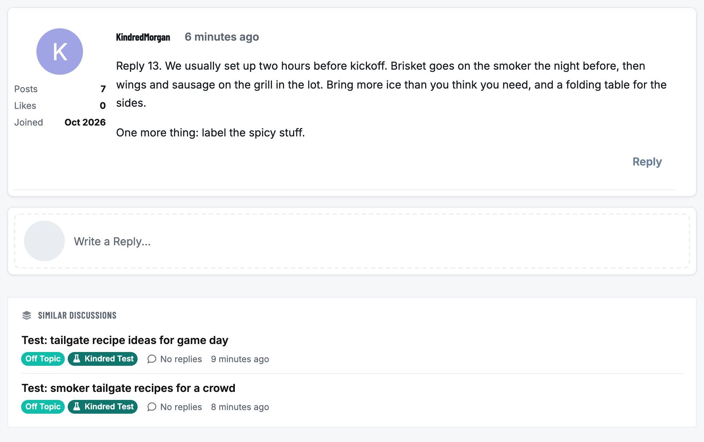
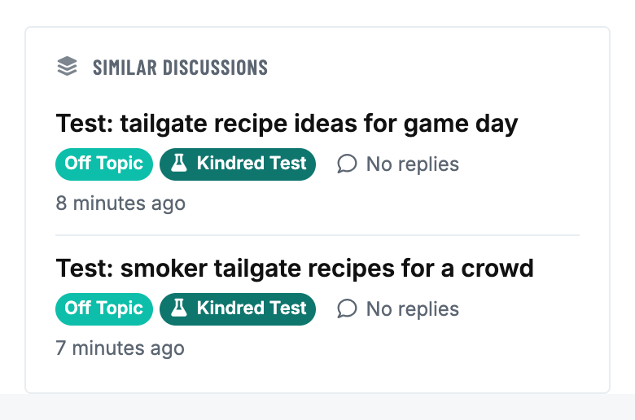
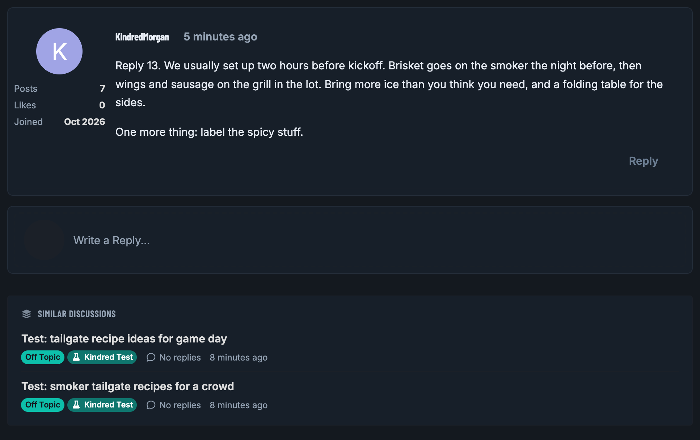
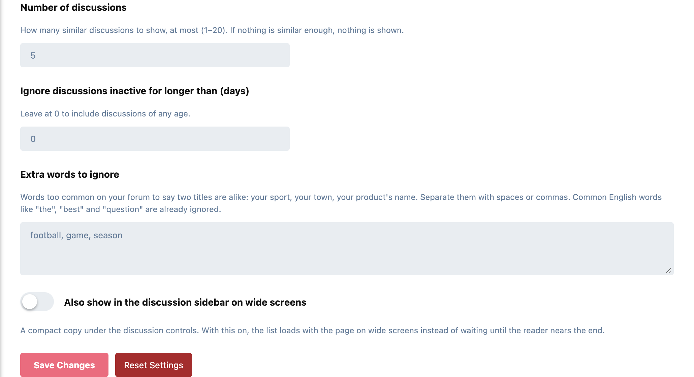
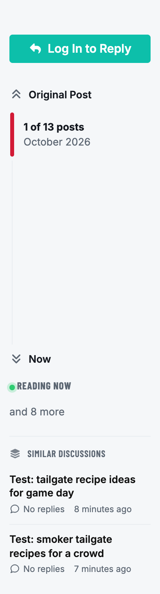

# Kindred

Similar discussions at the foot of every discussion, the way traditional forums
have always done it: finish reading a thread, and the next one worth reading is
right there.



Each row shows the title, its tags, how many replies it has and when it was last
active. When nothing is similar enough, nothing is shown: no empty box, no
"no results".

On a phone it's the same card, full width:



It uses your theme's own colours, so it fits the default theme, Bespoke and dark mode without styling.



## How it decides what's similar

- **The words in the title.** Kindred takes the words that say what a discussion is about: lowercased, punctuation gone, common English words like "the", "best" and "question" left out, and nothing under three letters. "Recipe" and "recipes" count as the same word.
- **Your database does the matching.** On MySQL and MariaDB it uses the FULLTEXT index Flarum already keeps on discussion titles, so rare words count for more than common ones. Without one (SQLite, PostgreSQL) it falls back to matching the title's four longest words.
- **Shared tags and recent activity** move a match up the list. Neither is enough on its own: a discussion has to share enough of the title first.

## Who sees what

The list of candidates for a discussion is worked out once and kept for six hours, and worked out again as soon as the discussion is renamed. What each reader sees of it is not cached: every request is narrowed to that reader's own permissions, so a discussion in a tag a guest can't see never appears for a guest, and hidden or private discussions never appear at all.

## No extra load until it's needed

Nothing is requested when the page opens. Kindred waits until the reader is nearly at the end of the discussion, then makes one request for that discussion, never one per post.

## Settings

Admin → Kindred:



- **Number of discussions:** at most how many to show (5 by default)
- **Ignore discussions inactive for longer than:** in days; 0 for any age (the default)
- **Extra words to ignore:** words too common on your forum to mean two titles are alike, such as your sport, your town or your product's name
- **Also show in the discussion sidebar on wide screens:** a compact copy under the discussion controls, off by default. With it on, the list loads with the page on wide screens rather than waiting for the end of the discussion.



## Installation

```bash
composer require ernestdefoe/kindred
php flarum cache:clear
```

Then enable **Kindred** in the admin panel.

## Updating

```bash
composer update ernestdefoe/kindred
php flarum cache:clear
```

## Licence

MIT.
